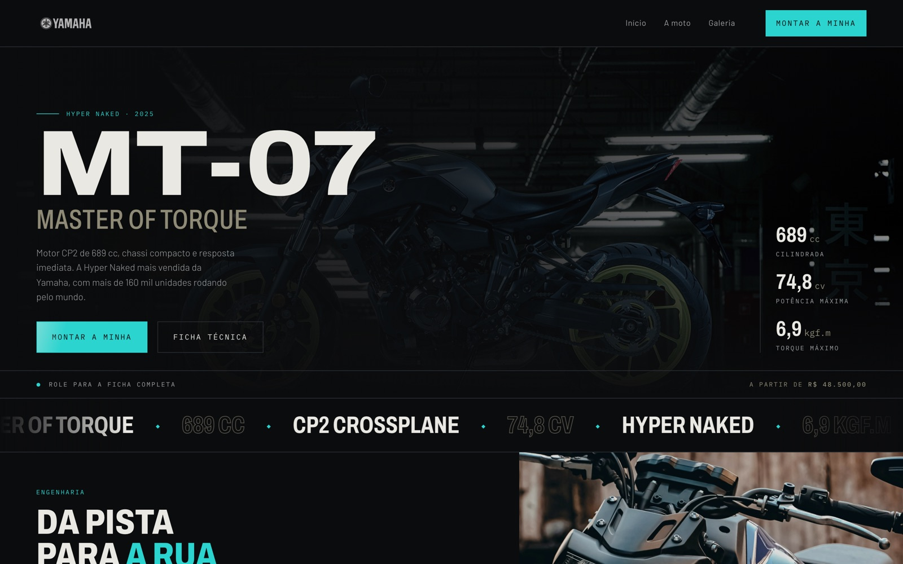
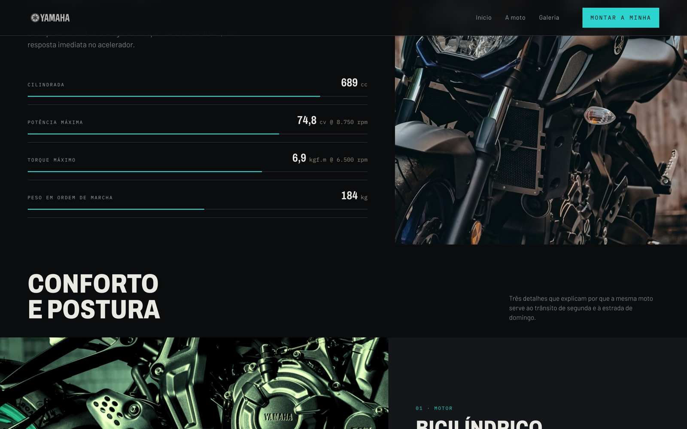
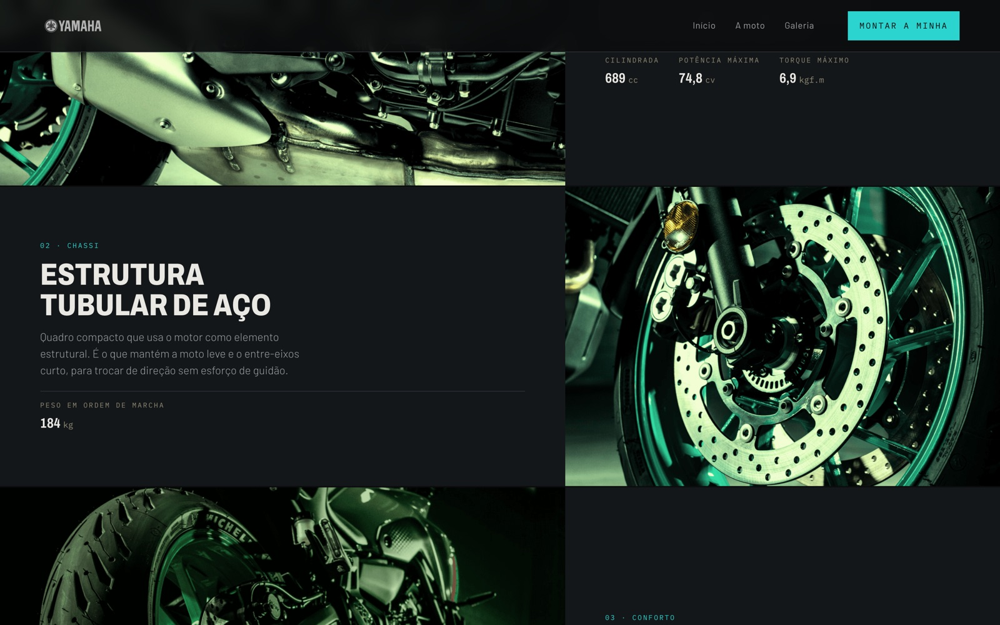
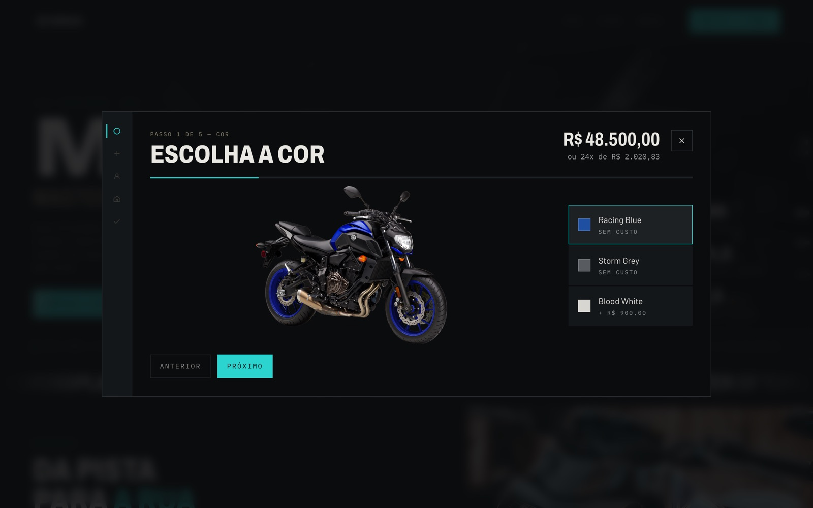
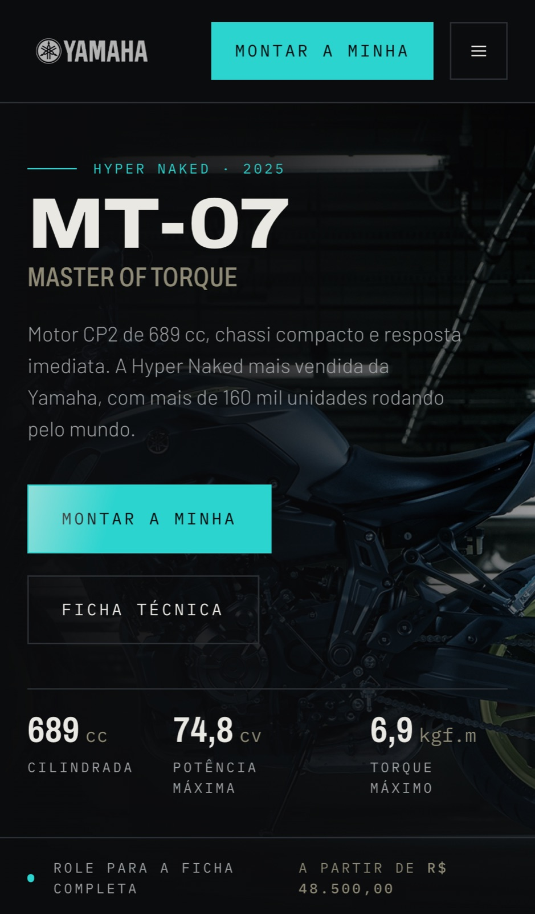

# Landing page MT-07

Landing page de compra de motocicleta: ficha técnica, seção editorial de detalhes e um configurador de cinco passos que vai da escolha da cor até a confirmação do pedido.

Projeto de estudo, sem vínculo com a fabricante. Todas as marcas e imagens pertencem aos seus donos.

**No ar:** https://yamaha-mt-landing-page.vercel.app

---

## Telas

### Hero



### Ficha técnica

Cada especificação tem uma barra proporcional ao valor, derivada do próprio dado do catálogo.



### Capítulos de conforto

Uma foto grande por vez, com o argumento e os números daquele detalhe ao lado, alternando o lado a cada capítulo.



### Configurador

Cinco passos — cor, opcionais, dados, entrega e pagamento — com preço reativo, validação por campo e cartão que espelha o formulário.



### Responsivo

 

---

## Stack

| Camada | Escolha |
| ------ | ------- |
| UI | React 18 + Vite 5 |
| Estilo | Tailwind CSS 4, com tokens de cor, tipografia e espaçamento em `src/styles/index.css` |
| Movimento | Motion (`motion/react`) e CSS, respeitando `prefers-reduced-motion` |
| Estado | `useReducer` em `useConfigurator` — passo, cor, opcionais, formulários e total derivado |
| Testes | Vitest + Testing Library + jsdom |
| Qualidade | ESLint |

Fontes: Archivo (display variável), Barlow (corpo) e IBM Plex Mono (dado técnico).

## Rodando

```bash
npm install
npm run dev      # http://localhost:9000
```

```bash
npm test         # suíte completa (vitest)
npm run lint     # eslint, zero aviso tolerado
npm run build    # build de produção
npm run preview  # serve o build em http://localhost:9001
```

## Como o projeto se organiza

```
src/
├── data/catalog.js      # preço, cores, opcionais, ficha técnica, capítulos e campos de formulário
├── lib/                 # moeda, máscaras, validadores, formatação numérica e curva de easing
├── hooks/               # useConfigurator: a máquina de estado do fluxo de compra
├── components/
│   ├── ui/              # Button, Field, Reveal, CountUp, SpecMarquee
│   ├── layout/          # Header, Footer
│   ├── landing/         # Hero, SpecSheet, Gallery
│   └── configurator/    # Stepper, FieldGrid e os cinco passos
├── styles/index.css     # tema: tokens, escala tipográfica e camada de movimento
└── Pages/Home           # composição da página
```

Duas regras que valem em todo o código: **nenhum valor de produto vive em componente** — preço, cor, opcional e especificação saem do catálogo; e **nenhum componente calcula preço** — subtotal, total e parcela chegam prontos do hook, para a página não poder exibir dois números diferentes para a mesma coisa.

## Acessibilidade

- Configurador em `dialog` com foco preso, `Escape` para fechar, devolução do foco ao gatilho e o resto da página inerte enquanto aberto.
- Indicador de passos como `tablist`/`tab`/`tabpanel`, navegável pelas setas, Home e End.
- Erro de formulário fiel à mensagem do validador, nunca genérico.
- Sob `prefers-reduced-motion`, todo conteúdo aparece em estado final, sem animação.

---

Desenvolvido por **João Marcos**.
